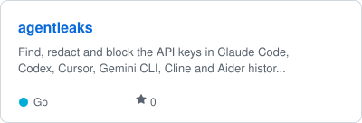
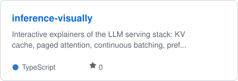

### About

Physics and EECS (AI track) at National Tsing Hua University, applying for PhD entry in 2027. At the HMI Lab I build
generative decoders that reconstruct 3D spatial structure from fMRI; my other work covers predictive coding,
associative memory and sampling-based inference.

### Highlights

- **2nd of 609 teams**, 2025 NSF HDR ML Challenge on anomaly detection, as team captain
- **2nd worldwide**, climate track, 2026 NSF HDR ML Challenge
- **Four submissions under review at ICLR 2027**, one as first author
- Presented at an **AAAI-25 workshop**; **iGEM 2023 Gold Medal**, dry lab lead

### Featured projects

<a href="https://github.com/Arthur031221/agentleaks"><picture><source media="(prefers-color-scheme: dark)" srcset="assets/card-agentleaks-dark.svg"></picture></a>
<a href="https://github.com/Arthur031221/llm-doctor"><picture><source media="(prefers-color-scheme: dark)" srcset="assets/card-llm-doctor-dark.svg"></picture></a>
<a href="https://github.com/Arthur031221/modelshift"><picture><source media="(prefers-color-scheme: dark)" srcset="assets/card-modelshift-dark.svg"></picture></a>
<a href="https://github.com/Arthur031221/inference-visually"><picture><source media="(prefers-color-scheme: dark)" srcset="assets/card-inference-visually-dark.svg"></picture></a>

<a href="https://github.com/Arthur031221?tab=repositories&type=source">All projects</a>

### Open source

<a href="https://github.com/pulls?q=is%3Apr+author%3AArthur031221+is%3Amerged"><picture><source media="(prefers-color-scheme: dark)" srcset="assets/oss-dark.svg"></picture></a>

Merged upstream in [cudf](https://github.com/NVIDIA/cudf/pulls?q=is%3Apr+author%3AArthur031221+is%3Amerged), [kornia](https://github.com/kornia/kornia/pulls?q=is%3Apr+author%3AArthur031221+is%3Amerged), [Babylon.js](https://github.com/BabylonJS/Babylon.js/pulls?q=is%3Apr+author%3AArthur031221+is%3Amerged), [burn](https://github.com/tracel-ai/burn/pulls?q=is%3Apr+author%3AArthur031221+is%3Amerged), [ImageMagick](https://github.com/ImageMagick/ImageMagick/pulls?q=is%3Apr+author%3AArthur031221+is%3Amerged), [mpi4py](https://github.com/mpi4py/mpi4py/pulls?q=is%3Apr+author%3AArthur031221+is%3Amerged), [braindecode](https://github.com/braindecode/braindecode/pulls?q=is%3Apr+author%3AArthur031221+is%3Amerged), [moabb](https://github.com/NeuroTechX/moabb/pulls?q=is%3Apr+author%3AArthur031221+is%3Amerged), [pymdp](https://github.com/infer-actively/pymdp/pulls?q=is%3Apr+author%3AArthur031221+is%3Amerged), [stanza](https://github.com/stanfordnlp/stanza/pulls?q=is%3Apr+author%3AArthur031221+is%3Amerged), [supersplat](https://github.com/playcanvas/supersplat/pulls?q=is%3Apr+author%3AArthur031221+is%3Amerged), [splat-transform](https://github.com/playcanvas/splat-transform/pulls?q=is%3Apr+author%3AArthur031221+is%3Amerged), [MultiQC](https://github.com/MultiQC/MultiQC/pulls?q=is%3Apr+author%3AArthur031221+is%3Amerged).

### Stars

<picture><source media="(prefers-color-scheme: dark)" srcset="assets/stars-dark.svg"></picture>

<picture>
  <source media="(prefers-color-scheme: dark)" srcset="https://raw.githubusercontent.com/Arthur031221/Arthur031221/output/snake-dark.svg">
  
</picture>
