<a href="https://arthur031221.github.io/"><picture><source media="(prefers-color-scheme: dark)" srcset="assets/hero-dark.svg"></picture></a>

<picture><source media="(prefers-color-scheme: dark)" srcset="assets/honors-dark.svg"></picture>

### Research

At the HMI Lab (advisor: Po-Chih Kuo) I build generative decoders that reconstruct 3D spatial structure from fMRI. My other work
covers predictive coding, associative memory and sampling-based inference. Under review at ICLR 2027:

- Langevin Temporal Predictive Coding: From Point Estimates to Posterior Distributions
- DRAFT: Decoding and Reconstructing 3D Room Layouts from fMRI and Camera Trajectories (first author)
- The Readout Decides Which Hopfield Networks Have a Constant-Metric Energy
- Why MCPC Generalizes

Published: 

- MatrixQR: Matrix-Guided Refinement for Decoupling Reliability Control from Creative Edits in QR Code Generation. TAAI 2025, poster
- Classifying Vibration Modes Generated by the Michelson Interferometer Using Machine Learning Methods. Journal of Modern Physics, 2024
- Building Machine Learning Challenges for Anomaly Detection in Science. arXiv 2503.02112, 2025 (NSF HDR challenge paper)

### Open source

<a href="https://github.com/pulls?q=is%3Apr+author%3AArthur031221+is%3Amerged"><picture><source media="(prefers-color-scheme: dark)" srcset="assets/oss-dark.svg"></picture></a>

Merged upstream in [Babylon.js](https://github.com/BabylonJS/Babylon.js/pulls?q=is%3Apr+author%3AArthur031221+is%3Amerged), [3d-tiles](https://github.com/CesiumGS/3d-tiles/pulls?q=is%3Apr+author%3AArthur031221+is%3Amerged), [ImageMagick](https://github.com/ImageMagick/ImageMagick/pulls?q=is%3Apr+author%3AArthur031221+is%3Amerged), [MultiQC](https://github.com/MultiQC/MultiQC/pulls?q=is%3Apr+author%3AArthur031221+is%3Amerged), [cudf](https://github.com/NVIDIA/cudf/pulls?q=is%3Apr+author%3AArthur031221+is%3Amerged), [moabb](https://github.com/NeuroTechX/moabb/pulls?q=is%3Apr+author%3AArthur031221+is%3Amerged), [awesome-YuE](https://github.com/RevolutionLA/awesome-YuE/pulls?q=is%3Apr+author%3AArthur031221+is%3Amerged), [AliceVision](https://github.com/alicevision/AliceVision/pulls?q=is%3Apr+author%3AArthur031221+is%3Amerged), [braindecode](https://github.com/braindecode/braindecode/pulls?q=is%3Apr+author%3AArthur031221+is%3Amerged), [pytorch-image-models](https://github.com/huggingface/pytorch-image-models/pulls?q=is%3Apr+author%3AArthur031221+is%3Amerged), [pymdp](https://github.com/infer-actively/pymdp/pulls?q=is%3Apr+author%3AArthur031221+is%3Amerged), [kornia](https://github.com/kornia/kornia/pulls?q=is%3Apr+author%3AArthur031221+is%3Amerged), [FunASR](https://github.com/modelscope/FunASR/pulls?q=is%3Apr+author%3AArthur031221+is%3Amerged), [mpi4py](https://github.com/mpi4py/mpi4py/pulls?q=is%3Apr+author%3AArthur031221+is%3Amerged), [splat-transform](https://github.com/playcanvas/splat-transform/pulls?q=is%3Apr+author%3AArthur031221+is%3Amerged), [supersplat](https://github.com/playcanvas/supersplat/pulls?q=is%3Apr+author%3AArthur031221+is%3Amerged), [psychopy](https://github.com/psychopy/psychopy/pulls?q=is%3Apr+author%3AArthur031221+is%3Amerged), [stanza](https://github.com/stanfordnlp/stanza/pulls?q=is%3Apr+author%3AArthur031221+is%3Amerged), [burn](https://github.com/tracel-ai/burn/pulls?q=is%3Apr+author%3AArthur031221+is%3Amerged).

### Projects

<a href="https://github.com/Arthur031221/snipmd"><picture><source media="(prefers-color-scheme: dark)" srcset="assets/card-snipmd-dark.svg"></picture></a>
<a href="https://github.com/Arthur031221/modelshift"><picture><source media="(prefers-color-scheme: dark)" srcset="assets/card-modelshift-dark.svg"></picture></a>
<a href="https://github.com/Arthur031221/llm-doctor"><picture><source media="(prefers-color-scheme: dark)" srcset="assets/card-llm-doctor-dark.svg"></picture></a>
<a href="https://github.com/Arthur031221/agentleaks"><picture><source media="(prefers-color-scheme: dark)" srcset="assets/card-agentleaks-dark.svg"></picture></a>

<a href="https://github.com/Arthur031221?tab=repositories&type=source">All projects</a>

### Stars

<picture><source media="(prefers-color-scheme: dark)" srcset="assets/stars-dark.svg"></picture>

<picture>
  <source media="(prefers-color-scheme: dark)" srcset="https://raw.githubusercontent.com/Arthur031221/Arthur031221/output/snake-dark.svg">
  
</picture>

[Website](https://arthur031221.github.io/) &nbsp; [CV](https://arthur031221.github.io/CV.pdf) &nbsp; [LinkedIn](https://www.linkedin.com/in/arthur-lee-367511354)
