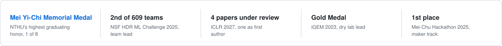
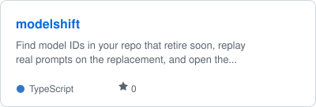
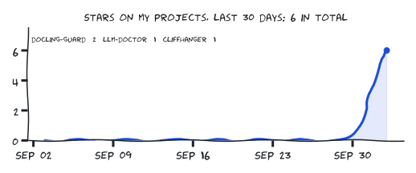

  

Physics and EECS (AI track) at National Tsing Hua University, applying for PhD entry in 2027. At the HMI Lab I build
generative decoders that reconstruct 3D spatial structure from fMRI, and I contribute fixes to GPU and scientific software.

My recent research asks how the brain represents and infers the space around us: recovering the layout of rooms from fMRI
and camera motion, letting predictive coding carry full posterior distributions instead of single point estimates, and
understanding when associative memory defines a well-behaved energy and why sampling-based predictive coding generalizes.

<picture><source media="(prefers-color-scheme: dark)" srcset="assets/honors-dark.svg"></picture>

### Publications

- MatrixQR: Matrix-Guided Refinement for Decoupling Reliability Control from Creative Edits in QR Code Generation. TAAI 2025, poster
- Classifying Vibration Modes Generated by the Michelson Interferometer Using Machine Learning Methods. Journal of Modern Physics, 2024
- Building Machine Learning Challenges for Anomaly Detection in Science. arXiv 2503.02112, 2025 (NSF HDR challenge paper)

### Open source

<a href="https://github.com/pulls?q=is%3Apr+author%3AArthur031221+is%3Amerged"><picture><source media="(prefers-color-scheme: dark)" srcset="assets/oss-dark.svg"></picture></a>

All 20 projects with my merged pull requests

 

[Babylon.js](https://github.com/BabylonJS/Babylon.js/pulls?q=is%3Apr+author%3AArthur031221+is%3Amerged), [3d-tiles](https://github.com/CesiumGS/3d-tiles/pulls?q=is%3Apr+author%3AArthur031221+is%3Amerged), [CloudCompare](https://github.com/CloudCompare/CloudCompare/pulls?q=is%3Apr+author%3AArthur031221+is%3Amerged), [ImageMagick](https://github.com/ImageMagick/ImageMagick/pulls?q=is%3Apr+author%3AArthur031221+is%3Amerged), [MultiQC](https://github.com/MultiQC/MultiQC/pulls?q=is%3Apr+author%3AArthur031221+is%3Amerged), [cudf](https://github.com/NVIDIA/cudf/pulls?q=is%3Apr+author%3AArthur031221+is%3Amerged), [moabb](https://github.com/NeuroTechX/moabb/pulls?q=is%3Apr+author%3AArthur031221+is%3Amerged), [awesome-YuE](https://github.com/RevolutionLA/awesome-YuE/pulls?q=is%3Apr+author%3AArthur031221+is%3Amerged), [AliceVision](https://github.com/alicevision/AliceVision/pulls?q=is%3Apr+author%3AArthur031221+is%3Amerged), [braindecode](https://github.com/braindecode/braindecode/pulls?q=is%3Apr+author%3AArthur031221+is%3Amerged), [pytorch-image-models](https://github.com/huggingface/pytorch-image-models/pulls?q=is%3Apr+author%3AArthur031221+is%3Amerged), [pymdp](https://github.com/infer-actively/pymdp/pulls?q=is%3Apr+author%3AArthur031221+is%3Amerged), [kornia](https://github.com/kornia/kornia/pulls?q=is%3Apr+author%3AArthur031221+is%3Amerged), [FunASR](https://github.com/modelscope/FunASR/pulls?q=is%3Apr+author%3AArthur031221+is%3Amerged), [mpi4py](https://github.com/mpi4py/mpi4py/pulls?q=is%3Apr+author%3AArthur031221+is%3Amerged), [splat-transform](https://github.com/playcanvas/splat-transform/pulls?q=is%3Apr+author%3AArthur031221+is%3Amerged), [supersplat](https://github.com/playcanvas/supersplat/pulls?q=is%3Apr+author%3AArthur031221+is%3Amerged), [psychopy](https://github.com/psychopy/psychopy/pulls?q=is%3Apr+author%3AArthur031221+is%3Amerged), [stanza](https://github.com/stanfordnlp/stanza/pulls?q=is%3Apr+author%3AArthur031221+is%3Amerged), [burn](https://github.com/tracel-ai/burn/pulls?q=is%3Apr+author%3AArthur031221+is%3Amerged)

### Projects

<a href="https://github.com/Arthur031221/cardsmith"><picture><source media="(prefers-color-scheme: dark)" srcset="assets/card-cardsmith-dark.svg"></picture></a>
<a href="https://github.com/Arthur031221/snipmd"><picture><source media="(prefers-color-scheme: dark)" srcset="assets/card-snipmd-dark.svg"></picture></a>
<a href="https://github.com/Arthur031221/cliffhanger"><picture><source media="(prefers-color-scheme: dark)" srcset="assets/card-cliffhanger-dark.svg"></picture></a>
<a href="https://github.com/Arthur031221/modelshift"><picture><source media="(prefers-color-scheme: dark)" srcset="assets/card-modelshift-dark.svg"></picture></a>

All 21 personal projects

| Project | What it does | Stars |
|:--|:--|--:|
| [docling-guard](https://github.com/Arthur031221/docling-guard) | Offline provenance validation and regression checks for Docling JSON | 1 |
| [gpuwait](https://github.com/Arthur031221/gpuwait) | GPU Idle Score for local LLM servers: measure idle time against Ollama, vLLM, mlx-lm | 0 |
| [receiptwise](https://github.com/Arthur031221/receiptwise) | Local receipt and warranty tracker with OCR, spend summaries, and printed deadline reminde | 0 |
| [labexplain](https://github.com/Arthur031221/labexplain) | Offline lab report reader with printed-range priority, cited adult examples, and optional  | 0 |
| [oss-launchbot](https://github.com/Arthur031221/oss-launchbot) | Policy-aware launch queue and guarded Reddit posting for open-source repositories | 0 |
| [reelrecipe](https://github.com/Arthur031221/reelrecipe) | Turn local cooking videos into recipe cards with Whisper, GLM-OCR, Ollama, and Mealie JSON | 0 |
| [ollama-verify](https://github.com/Arthur031221/ollama-verify) | Read-only integrity and storage audit for local Ollama models | 0 |
| [mlxtrace](https://github.com/Arthur031221/mlxtrace) | MLX training step profiler with power and memory sampling and a standalone HTML timeline | 0 |
| [installwall](https://github.com/Arthur031221/installwall) | Check direct npm, pip, gem, and cargo installs for typosquats, new packages, and sourced m | 0 |
| [cardsmith](https://github.com/Arthur031221/cardsmith) | Offline flashcards from PDFs, slides, and notes. Generate locally, study with SM-2, export | 0 |
| [papercompass](https://github.com/Arthur031221/papercompass) | Recommendations over your own arXiv library, offline after setup. Not another digest bot. | 0 |
| [gpuwho](https://github.com/Arthur031221/gpuwho) | Live system GPU use alongside named local LLM processes on Apple Silicon, with optional Ne | 0 |
| [songforge](https://github.com/Arthur031221/songforge) | Local Suno-style song studio for Apple Silicon: lyrics to full songs with vocals and cover | 0 |
| [snipmd](https://github.com/Arthur031221/snipmd) | Hotkey, drag a box, get Markdown or LaTeX on your clipboard. Offline Mathpix Snip alternat | 0 |
| [cliffhanger](https://github.com/Arthur031221/cliffhanger) | Stop hook and skill that keeps Claude Code from ending the turn with work still owed, and  | 0 |
| [slopblock](https://github.com/Arthur031221/slopblock) | Adblock for AI slop: blurs machine-written posts in your feeds, on-device, and shows why.  | 0 |
| [modelshift](https://github.com/Arthur031221/modelshift) | Find model IDs in your repo that retire soon, replay real prompts on the replacement, and  | 0 |
| [llm-doctor](https://github.com/Arthur031221/llm-doctor) | brew doctor for local LLMs: dedupe Ollama, LM Studio, HF and MLX weights, catch stale temp | 0 |
| [inference-visually](https://github.com/Arthur031221/inference-visually) | Interactive explainers of the LLM serving stack: KV cache, paged attention, continuous bat | 0 |
| [shiftgear](https://github.com/Arthur031221/shiftgear) | Model and effort routing skill for Claude Code, Codex, Gemini CLI, Cursor, and OpenCode, w | 0 |
| [agentleaks](https://github.com/Arthur031221/agentleaks) | Find, redact and block the API keys in Claude Code, Codex, Cursor, Gemini CLI, Cline and A | 0 |

### Activity

<picture><source media="(prefers-color-scheme: dark)" srcset="assets/stars-dark.svg"></picture>

<picture>
  <source media="(prefers-color-scheme: dark)" srcset="https://raw.githubusercontent.com/Arthur031221/Arthur031221/output/snake-dark.svg">
  
</picture>

