  

  [Research website](https://arthur031221.github.io/) · [Projects](https://github.com/Arthur031221?tab=repositories) · [Merged upstream contributions](https://github.com/pulls?q=is%3Apr+author%3AArthur031221+is%3Amerged)

I am **Chi-Wei Lee**, a Physics and EECS (AI track) double major at National Tsing Hua University, Taiwan. At the HMI Lab, I work on generative models that reconstruct 3D spatial structure from fMRI. I also build open source tools and fix correctness bugs in scientific and GPU software. My research interests include predictive coding, associative memory, and sampling-based inference.

### Featured repositories

| Project | Why it exists |
| --- | --- |
| [quantum-allosteric-scanner](https://github.com/Arthur031221/quantum-allosteric-scanner) | Predicts protein allosteric sites from one unbound structure with continuous-time quantum walks. |
| [agentleaks](https://github.com/Arthur031221/agentleaks) | Finds and redacts exposed API keys in local coding-agent histories. |
| [inference-visually](https://github.com/Arthur031221/inference-visually) | Interactive, browser-based explanations of LLM inference. [Try the live demo](https://arthur031221.github.io/inference-visually/). |
| [NVIDIA cuDF](https://github.com/NVIDIA/cudf) | GPU dataframe library where I contributed two merged correctness fixes. |
| [Stanza](https://github.com/stanfordnlp/stanza) | NLP toolkit where I contributed three merged token-reconstruction fixes. |
| [Kornia](https://github.com/kornia/kornia) | Computer vision library where I fixed a per-class detection metric. |

### Merged upstream work

| Project | Contribution |
| --- | --- |
| [NVIDIA cuDF](https://github.com/NVIDIA/cudf) | Fixed [empty strings becoming null in `Series.str.join`](https://github.com/NVIDIA/cudf/pull/24308) and [time-of-day loss at month boundaries](https://github.com/NVIDIA/cudf/pull/24310). |
| [Stanza](https://github.com/stanfordnlp/stanza) | Repaired multi-word token reconstruction across [three merged PRs](https://github.com/stanfordnlp/stanza/pulls?q=is%3Apr+is%3Amerged+author%3AArthur031221). |
| [Kornia](https://github.com/kornia/kornia) | Corrected [per-class recall in mean average precision](https://github.com/kornia/kornia/pull/5079). |
| [Burn](https://github.com/tracel-ai/burn) | Clamped probabilities in [label-smoothed cross entropy](https://github.com/tracel-ai/burn/pull/5892). |
| [pymdp](https://github.com/infer-actively/pymdp) | Fixed [label-list indexing to select blocks instead of diagonals](https://github.com/infer-actively/pymdp/pull/442). |
| [braindecode](https://github.com/braindecode/braindecode) | Corrected [Hilbert-frequency output length and Nyquist handling](https://github.com/braindecode/braindecode/pull/1188). |

I focus on bugs that produce wrong answers, with reproducible cases and regression tests.

### More work

My research and creative projects include [X-Ray](https://github.com/Arthur031221/X-Ray), [NSF-HDR](https://github.com/Arthur031221/NSF-HDR), [MatrixQR](https://github.com/Arthur031221/MatrixQR), and my [bilingual research website](https://arthur031221.github.io/). I also build practical local tools: [gpuwho](https://github.com/Arthur031221/gpuwho), [papercompass](https://github.com/Arthur031221/papercompass), [installwall](https://github.com/Arthur031221/installwall), [cardsmith](https://github.com/Arthur031221/cardsmith), [modelshift](https://github.com/Arthur031221/modelshift), [llm-doctor](https://github.com/Arthur031221/llm-doctor), [slopblock](https://github.com/Arthur031221/slopblock), [snipmd](https://github.com/Arthur031221/snipmd), [cliffhanger](https://github.com/Arthur031221/cliffhanger), [songforge](https://github.com/Arthur031221/songforge), and [shiftgear](https://github.com/Arthur031221/shiftgear).

I captained a team that placed **2nd of 609** in the 2025 NSF HDR ML Challenge anomaly-detection track. I also visited UCLA Samueli through the Taiwan Global Pathfinders program in 2026. [More about my research and experience](https://arthur031221.github.io/).

  

